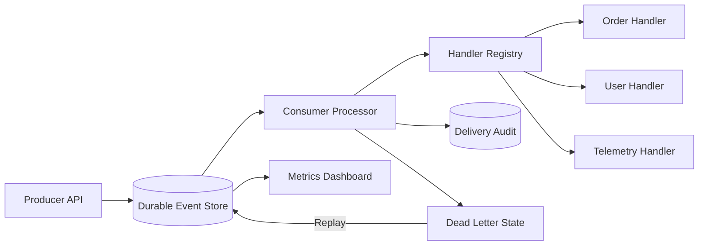

# Architecture

The event record and each delivery attempt are separate. That distinction makes retries auditable and preserves the original message even after multiple failures.

Producer idempotency prevents duplicate events when callers retry a publish request. Handler failures do not delete events; they transition state until the retry budget is exhausted.
